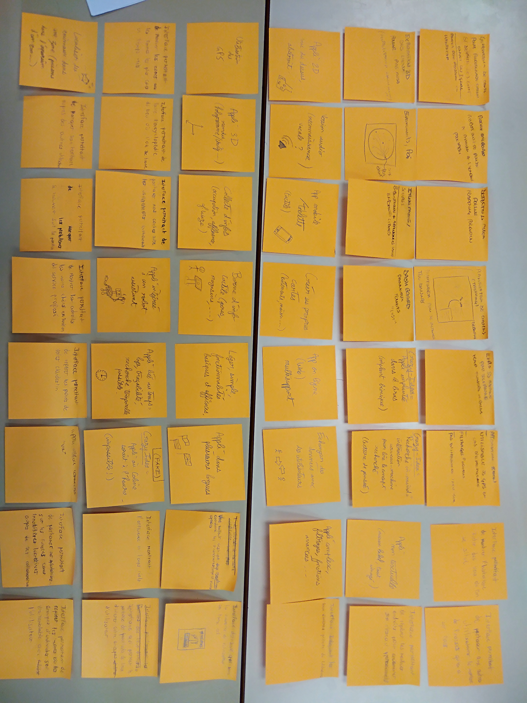
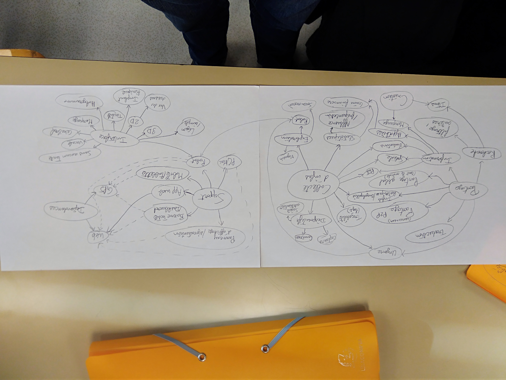

# ihm

## Réalisation de questionnaires et interviews :
 * google form : https://docs.google.com/forms/d/e/1FAIpQLSfDUnpIm5im4AUXSGb_l6DYa1gcPejyMTY5wNuQANfOaUWwBw/viewform
 * interviews (enregistrements vocaux / notes papiers)
 
#### Résultats :
 * une majorité d'utilisateurs qui veulent pouvoir calculer des itinéraires
 * un usage majoritairement "mobile" : un peu partout, tout le temps. Un support majoritaire : le smartphone.
 * quelques idées innovantes :
    * pouvoir choisir une époque et voir la carte évoluer avec le temps (intérêt historique / culturel)
    * pouvoir cartographier des intérieurs et le placement d'objets (bâtiments, pièces, archives, meubles, bibliothèques ...)
    * des systèmes fonctionnels même sans réseau ou sans gps (pour les appels d'urgence par exemple)
 
## Brainstorming :

#### Post-its pour générer un maximum d'idées, donc des "crazy ideas" :

#### MindMap pour relier entre eux les concepts mis en avant par les post-its :

#### Les idées retenues :

(Ajouter les concepts retenus)

## Prototypes vidéo :

(Ajouter les liens des vidéos)
